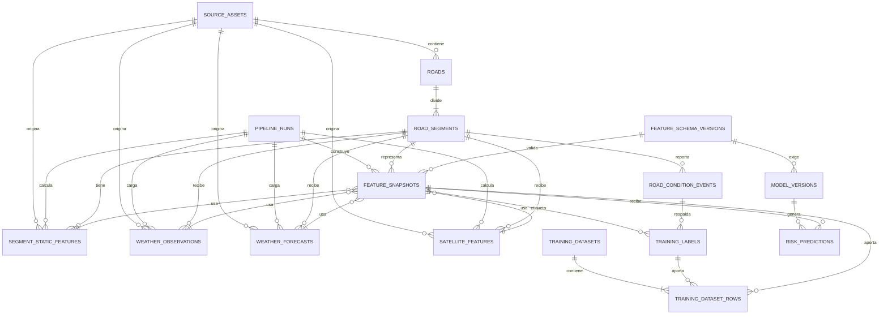

# Última Ventana — Esquema de base de datos

## Objetivo

Este esquema guarda el cruce geoespacial y temporal de IDECorr, IGN, NASA GPM,
SMN y Sentinel-1 por segmento de camino. El resultado del cruce se congela en
un `feature_snapshot` reproducible antes de enviarlo al modelo.

La separación principal es:

```text
fuentes y ejecuciones
        ↓
datos asociados a road_segment
        ↓
feature_snapshot sin target
        ↓
modelo
        ↓
risk_prediction
```

Los labels y la composición de datasets de entrenamiento se guardan en tablas
separadas. Así, una consulta de inferencia no puede incorporar el target por
accidente.

## Diagrama de relaciones



## Capas del esquema

Todas las tablas y vistas viven en el schema PostgreSQL `ultima_ventana`.

### Fuentes y ejecuciones

`source_assets` registra un producto o archivo externo. Conserva proveedor,
dataset, versión, identificador original, URI, checksum, período cubierto y
metadata. Los GeoTIFF, GRIB, NetCDF y otros archivos pesados permanecen fuera de
PostgreSQL.

`pipeline_runs` identifica una ejecución de ingesta, cruce espacial, generación
de features, armado de dataset o inferencia. `code_version` y `parameters`
permiten reproducir la operación.

### Territorio

`roads` conserva el camino fuente como `MULTILINESTRING` en EPSG:4326.

`road_segments` es la entidad común a todas las fuentes. Cada segmento tiene un
índice estable dentro del camino, geometría `LINESTRING`, longitud en metros y
un identificador numérico independiente del nombre del camino.

### Entradas cruzadas

| Tabla | Fuente principal | Tiempo significativo | Valores principales |
|---|---|---|---|
| `segment_static_features` | IGN MDE-Ar | `computed_at` | elevación y pendiente |
| `weather_observations` | NASA GPM/IMERG | `observed_at` | lluvia 6 h, 24 h y 72 h |
| `weather_forecasts` | SMN/WRF | `issued_at`, `valid_at` | lluvia prevista 3 h, 6 h y 12 h |
| `satellite_features` | Sentinel-1 | `observed_at` | agua 50/100 m, cambio y backscatter |

Cada fila conserva el asset y la ejecución que la produjo. Los índices por
`segment_id` y tiempo permiten obtener eficientemente la última fuente válida.

### Resultado del feature engineering

`feature_snapshots` contiene una fila por:

```text
build_run_id + segment_id + prediction_time
```

Además de los valores, guarda:

- `as_of_time`: corte de información conocido al generar la predicción;
- `prediction_time`: instante futuro que representa el vector;
- `feature_schema_id`: contrato que interpreta las columnas;
- identificadores exactos de topografía, observación meteorológica, pronóstico
  y observación satelital usados;
- metadata de imputación y flags de calidad.

Los snapshots son append-only. Si cambia una fuente, una regla o una feature se
crean un nuevo `pipeline_run` y un nuevo snapshot; nunca se sobrescribe el
registro utilizado por un modelo anterior.

El trigger de linaje rechaza:

- observaciones meteorológicas o satelitales posteriores a `as_of_time`;
- pronósticos emitidos después de `as_of_time`;
- pronósticos cuyo `valid_at` no coincide con `prediction_time`;
- referencias a datos de otro segmento;
- un `build_run_id` que no sea de tipo `FEATURE_BUILD`.

## Contrato del modelo v1

La tabla `feature_schema_versions` contiene la definición legible por máquina,
el orden de columnas, unidades, tipos y checksum. La versión inicial usa estas
siete features obligatorias:

1. `rain_24h_mm`
2. `rain_72h_mm`
3. `forecast_rain_6h_mm`
4. `forecast_rain_12h_mm`
5. `elevation_mean_m`
6. `slope_mean_pct`
7. `water_coverage_100m_ratio`

El snapshot también permite guardar estas features opcionales para evaluar una
futura versión del modelo:

- `rain_6h_mm`;
- `forecast_rain_3h_mm`;
- `water_coverage_50m_ratio`;
- `water_change_ratio`;
- `vv_backscatter_mean`;
- `vh_backscatter_mean`.

La vista `ml_feature_vectors_v1` es el contrato estable de inferencia. El código
Python debe seleccionar las columnas explícitamente en el orden del schema:

```sql
SELECT
    rain_24h_mm,
    rain_72h_mm,
    forecast_rain_6h_mm,
    forecast_rain_12h_mm,
    elevation_mean_m,
    slope_mean_pct,
    water_coverage_100m_ratio
FROM ultima_ventana.ml_feature_vectors_v1
WHERE feature_snapshot_id = :feature_snapshot_id;
```

Para batch inference:

```sql
SELECT
    feature_snapshot_id,
    segment_id,
    prediction_time,
    rain_24h_mm,
    rain_72h_mm,
    forecast_rain_6h_mm,
    forecast_rain_12h_mm,
    elevation_mean_m,
    slope_mean_pct,
    water_coverage_100m_ratio
FROM ultima_ventana.ml_feature_vectors_v1
WHERE prediction_time BETWEEN :from_time AND :to_time
ORDER BY prediction_time, segment_id;
```

`segment_id`, `as_of_time`, `prediction_time` y `feature_snapshot_id` son
metadata: sirven para trazabilidad, pero no se incluyen dentro de la matriz que
recibe XGBoost.

Ejemplo de adaptación en Python, manteniendo el orden explícito:

```python
FEATURE_COLUMNS_V1 = [
    "rain_24h_mm",
    "rain_72h_mm",
    "forecast_rain_6h_mm",
    "forecast_rain_12h_mm",
    "elevation_mean_m",
    "slope_mean_pct",
    "water_coverage_100m_ratio",
]

row = connection.execute(
    text("""
        SELECT
            feature_snapshot_id,
            rain_24h_mm,
            rain_72h_mm,
            forecast_rain_6h_mm,
            forecast_rain_12h_mm,
            elevation_mean_m,
            slope_mean_pct,
            water_coverage_100m_ratio
        FROM ultima_ventana.ml_feature_vectors_v1
        WHERE feature_snapshot_id = :snapshot_id
    """),
    {"snapshot_id": snapshot_id},
).mappings().one()

matrix = [[row[column] for column in FEATURE_COLUMNS_V1]]
risk_score = float(model.predict_proba(matrix)[0, 1])
```

## Semántica temporal

Todos los tiempos se persisten como `TIMESTAMPTZ` en UTC. La interfaz puede
convertirlos a la zona horaria local.

Las acumulaciones de lluvia observada representan ventanas anteriores a
`observed_at`. Los acumulados de pronóstico son valores normalizados por el
feature pipeline para el horizonte identificado por `valid_at`. La definición
exacta de cada cálculo debe mantenerse en el código compartido por training e
inferencia y versionarse junto con `feature_schema_versions`.

La selección temporal de una fuente siempre respeta:

```text
weather_observation.observed_at <= snapshot.as_of_time
satellite_feature.observed_at   <= snapshot.as_of_time
weather_forecast.issued_at      <= snapshot.as_of_time
weather_forecast.valid_at        = snapshot.prediction_time
```

Esto evita utilizar información que todavía no estaba disponible en el momento
representado por el snapshot.

## Training y labels

`road_condition_events` conserva la observación de dominio sin transformarla:

```text
TRANSITABLE | DIFFICULT | INTRANSITABLE
```

`training_labels` contiene el target binario, su origen y la versión de la regla
que lo generó. Para v1:

```text
target_name          = intransitable_within_6h
target_horizon_hours = 6
target_value         = 0 | 1
label_origin         = OBSERVED | HEURISTIC | SYNTHETIC
```

La conversión de `DIFFICULT` no está fijada en SQL. Debe quedar declarada en
`label_rule_version`, evitando reinterpretar datasets históricos cuando cambie
la política.

`training_datasets` registra una versión exportable y
`training_dataset_rows` congela los snapshots, labels y splits exactos. La vista
`ml_training_rows_v1` permite exportar Parquet manteniendo la misma matriz que
se utiliza en producción:

```sql
SELECT *
FROM ultima_ventana.ml_training_rows_v1
WHERE training_dataset_version = :dataset_version
ORDER BY split, feature_snapshot_id;
```

## Predicciones

`model_versions` relaciona un artifact XGBoost con el dataset de entrenamiento,
feature schema, target, horizonte, checksum y threshold crítico. El dataset es
opcional para motores heurísticos que no hayan sido entrenados.

`risk_predictions` relaciona el resultado directamente con el snapshot que
recibió el modelo y con su ejecución `INFERENCE`. Un trigger impide ejecutar un
modelo sobre un snapshot con otra versión de features o utilizar una ejecución
de otro tipo.

## Supabase y despliegue

El proyecto remoto es `lepivdjhmuzlinfhxsyr`. Las migraciones versionadas son
el único origen de verdad y viven en `supabase/migrations/`.

FastAPI debe conectarse con `DATABASE_URL` usando la URI **Session pooler** de
Supabase, puerto 5432 y `sslmode=require`. El schema `ultima_ventana` permanece
privado: se revocan permisos a `PUBLIC`, `anon`, `authenticated` y
`service_role`, por lo que no queda expuesto mediante la Data API.

En PowerShell:

```powershell
npm install
Copy-Item .env.example .env
# Completar .env con la URI Session pooler y la contraseña de base de datos.
npx supabase login
npm run supabase:link
npm run db:preflight
npm run db:push:dry
npm run db:push
npm run db:lint
npm run db:check
npm run db:test
```

`db:preflight` es de solo lectura y aborta si encuentra un schema preexistente
que no esté registrado por estas migraciones. `db:test` abre una transacción,
prueba constraints, linaje, vistas y el contrato del modelo, y termina con
`ROLLBACK` para no dejar datos de prueba.

No ejecutar `supabase db reset --linked`: ese comando es destructivo sobre una
base remota.

## Reglas operativas

- Ingestar con `INSERT ... ON CONFLICT` usando las claves naturales declaradas.
- No unir fuentes mediante nombres de caminos; usar siempre `segment_id`.
- No actualizar ni borrar snapshots ya consumidos.
- No usar `SELECT *` para construir la matriz del modelo.
- No almacenar el target dentro de `feature_snapshots`.
- No reemplazar valores faltantes por cero salvo que una regla versionada lo
  establezca; registrar cualquier imputación en `imputation_metadata`.
- Exportar el dataset final a Parquet y guardar URI y checksum en
  `training_datasets`.
